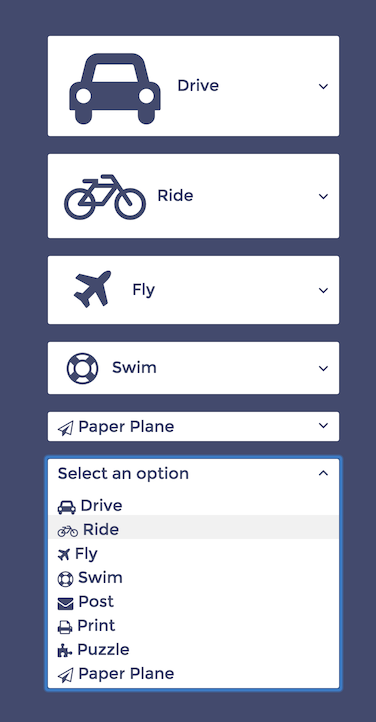

Font Awesome Select
-------------------

A Lightweight and simple select field that is enabled for any Font Awesome icon to be used in the options.

Example Usage (Existing select field)
=====================================

.. code-block:: html

  <select id="my-select">
    <option>Select an option</option>
    <option data-meta="car" value="1">Drive</option>
    <option data-meta="bicycle" value="2">Ride</option>
    <option data-meta="plane" value="3">Fly</option>
  </select>

.. code-block:: javascript

  var select = document.getElementById("my-select");
  var options = {
    "optionSize": "fa-2x",
    "selectionSize": "fa-1x"
  };

  var faSelect = new FontAwesomeSelect(select, options);
  

Example Usage (From JSON)
=========================

.. code-block:: html

  <select id="my-select">
  </select>
  
.. code-block:: javascript

  var options = {
    "optionSize": "fa-2x",
    "selectionSize": "fa-1x"
  };
  var data = [
    {
      "label": "Select an option",
    },
    {
      "label": "Drive",
      "meta": "car",
      "value": "1"
    },
    {
      "label": "Ride",
      "meta": "bicycle",
      "value": "2"
    },
    {
      "label": "Fly",
      "meta": "plane",
      "value": "3"
    },
  ];
  
  var faSelect = new FontAwesomeSelect(data, options);
  
Options
=======
  
``optionSize`` -- The size of the icons in the options list. "fa-lg" is the default. ("fa-lg", "fa-2x", "fa-3x", "fa-4x", or "fa-5x")

``selectionSize``  -- the size of the selected icon. "fa-lg" is the default. ("fa-lg", "fa-2x", "fa-3x", "fa-4x", or "fa-5x")
